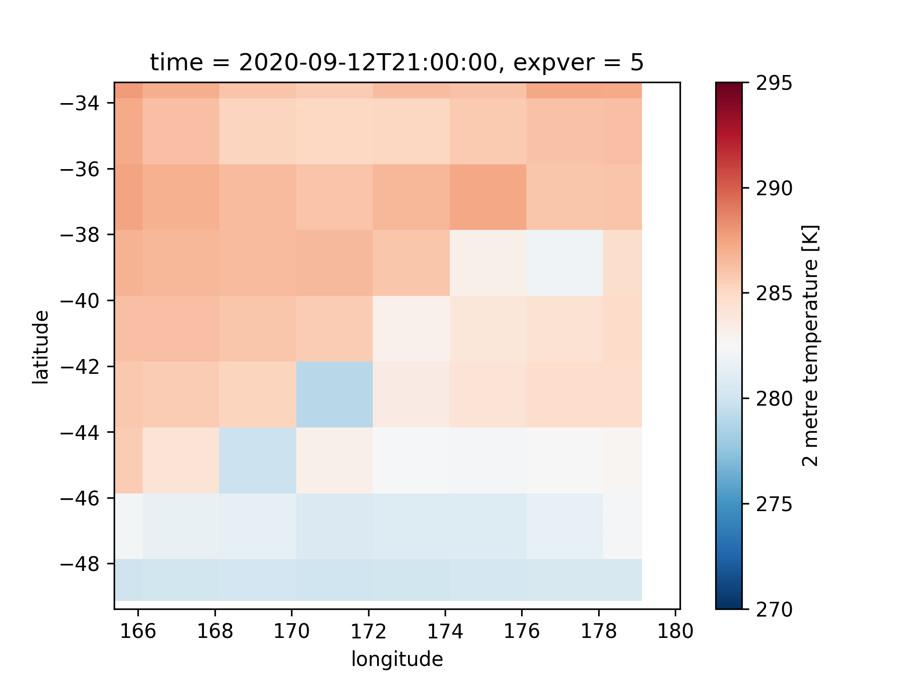
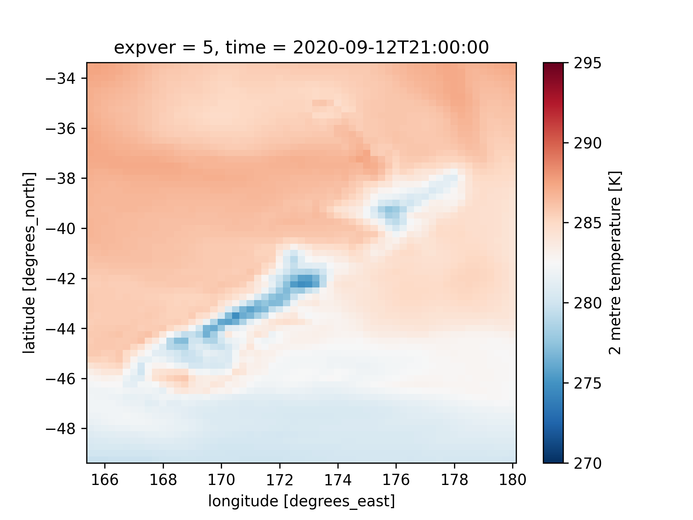
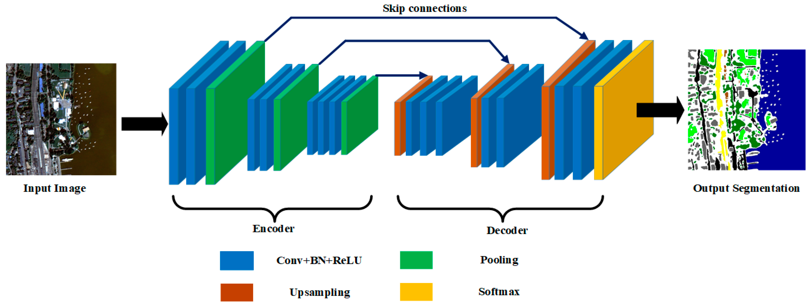
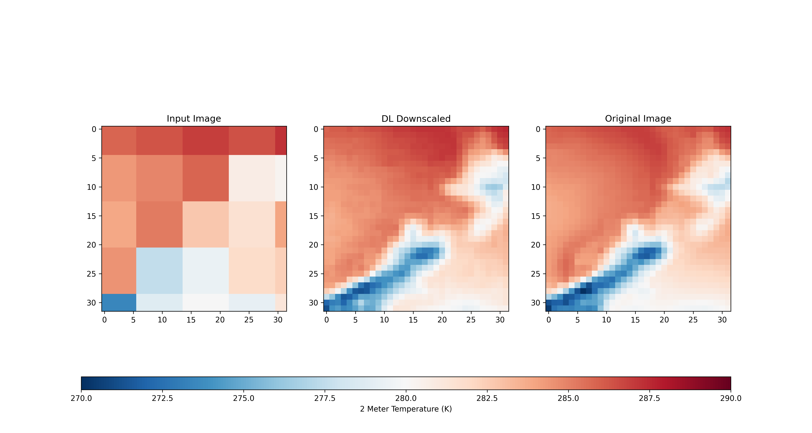
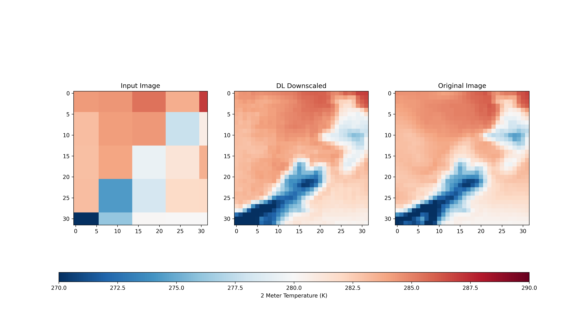
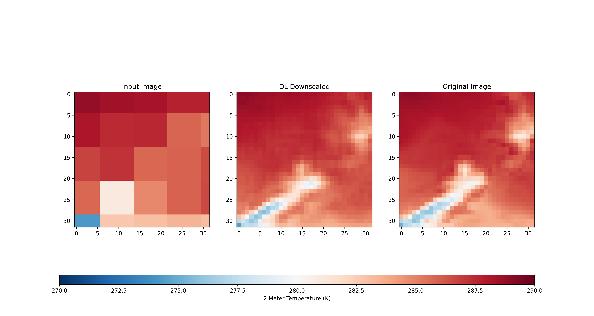
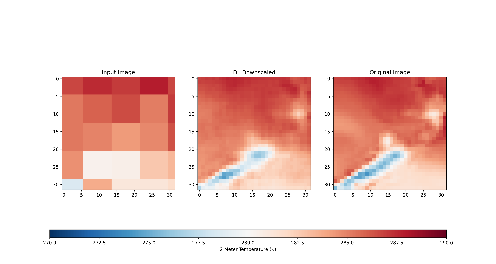

# Downscaling Reanalysis Data

## Aims
To explore our capabilities with "dynamical downscaling" a simple test project has been created to downscale reanalysis data. 

1. To use transfer learning to downscale reanalysis (an encoder like structure).

## Methodology:

### Reanalysis
Downscaling using machine-learning is performed on hourly ERA5 reanalysis which is selected over the New Zealand domain. The reanalysis data is located in the /data/nz_reanalysis_data_hourly.nc.

This reanalysis data contains 2600 hourly samples / snapshots of the New Zealand 2 meter temperature over a period of 3 months in 2020. The first 2 months are used as training data while the last month is used as testing data. Note, because we have a limited number of months the accuracy would be significantly less than having more data - however this is a test case to explore the methodology. 

### Processing
1. The predictor, namely X is interpolated at a coarse resolution - to be approximately 1/8th of the resolution of the original reanalysis. The reanalysis is at approximately 25 km, and the predictor is interpolated at 200 km. While this means that the information at this coarse scale is 1/64 th of the original reanalysis, the dimensionality is constant. An example of this processing is illustrated below.

2. The output variable, y is kept at the 25 km resolution. 

3. To use capabilities in transfer learning a linear transformation is applied to the image, to scale the image to the range [0,255] with a total of three channels. 

### Machine Learning:
To rapidly train our model using ML capabilities, we have used a pretrained UNET architecture with a VGG backbone, the repository is found here https://github.com/qubvel/segmentation_models. Note this repository was created for computer vision or image segmentation, but we have adapted this for our own purpose. 

The encoder part of the model, or the feature selection bottleneck (like PCA on steroids) is not trained, and the encoder weights are used from image net. 

An illustration of the model architecutre is also shown below. 

### Training
The model was trained for a total of 330 epochs on a CPU - this took about 3 hours.

## Results
The results are remarkable - here are some examples. Of course with more data - the results will be better. 

